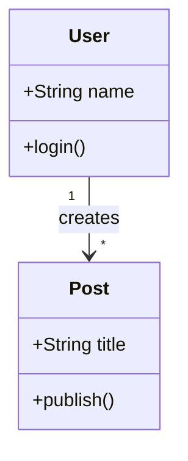
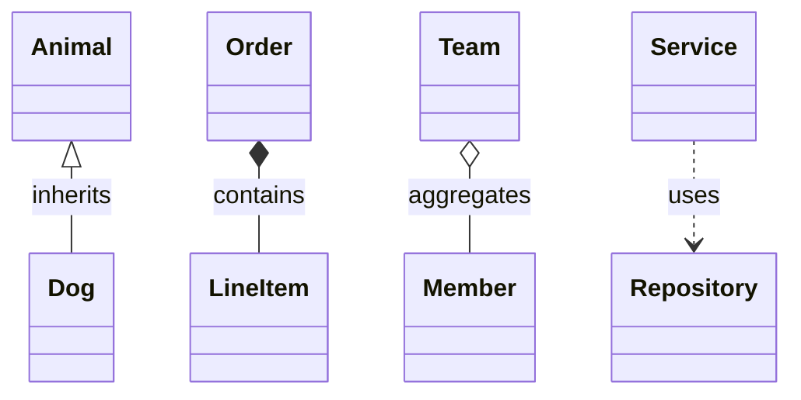

# Class Diagrams

Use class diagrams for object models, domain concepts, and typed relationships.

## Minimal Pattern

Example file: `assets/examples/class/basic.mmd`.

## Rules

- Show only fields and methods needed for the discussion.
- Prefer domain relationships over every implementation detail.
- Use cardinality labels when multiplicity matters.
- Do not model interfaces unless the diagram explains a real boundary.

## Relationships

