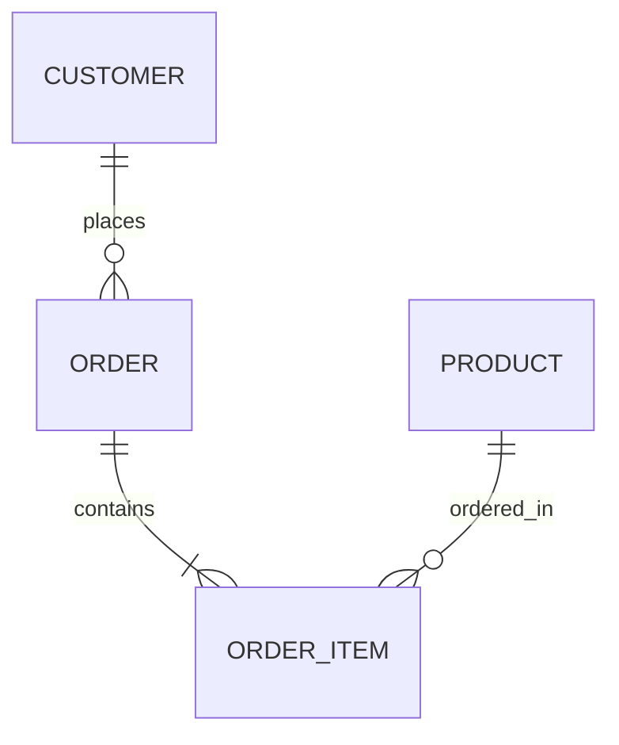
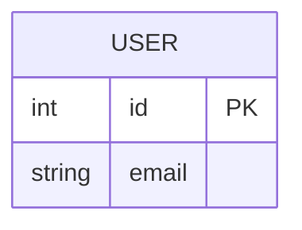

# ER Diagrams

Use ER diagrams for database schemas and entity relationships.

## Minimal Pattern

Example file: `assets/examples/er/basic.mmd`.

## Cardinality

- `||--||`: one to one
- `||--o{`: one to zero-or-many
- `||--|{`: one to one-or-many
- `}o--o{`: many to many

## Rules

- Use entity names that match tables or domain nouns.
- Include attributes only when they clarify the relationship.
- Quote relationship labels with spaces.
- Split large schemas by bounded context.

## Attributes

