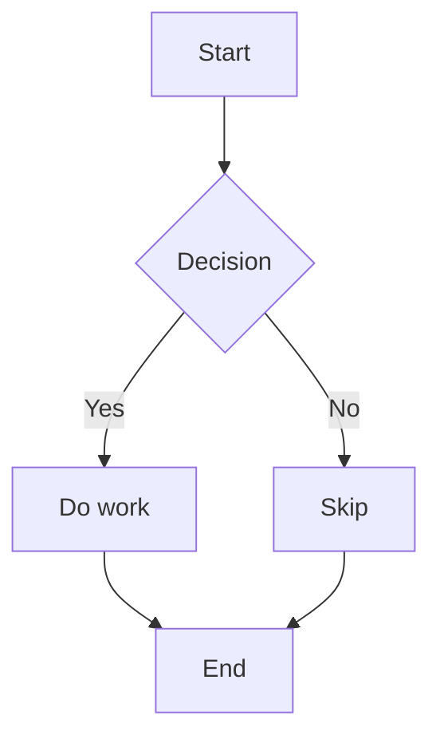
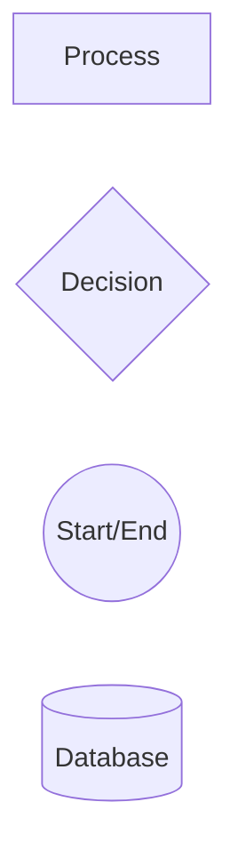

# Flowcharts

Use flowcharts for processes, routing, workflows, and decision trees.

## Minimal Pattern

Example file: `assets/examples/flowchart/basic.mmd`.

## Rules

- Pick a direction first: `TD` for top-down, `LR` for left-to-right.
- Use diamonds only for decisions.
- Label branches when the condition matters.
- Split workflows once a diagram needs more than one screen to read.

## Common Shapes

