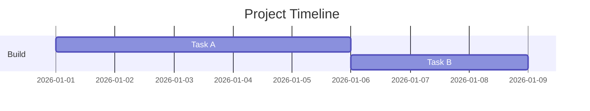
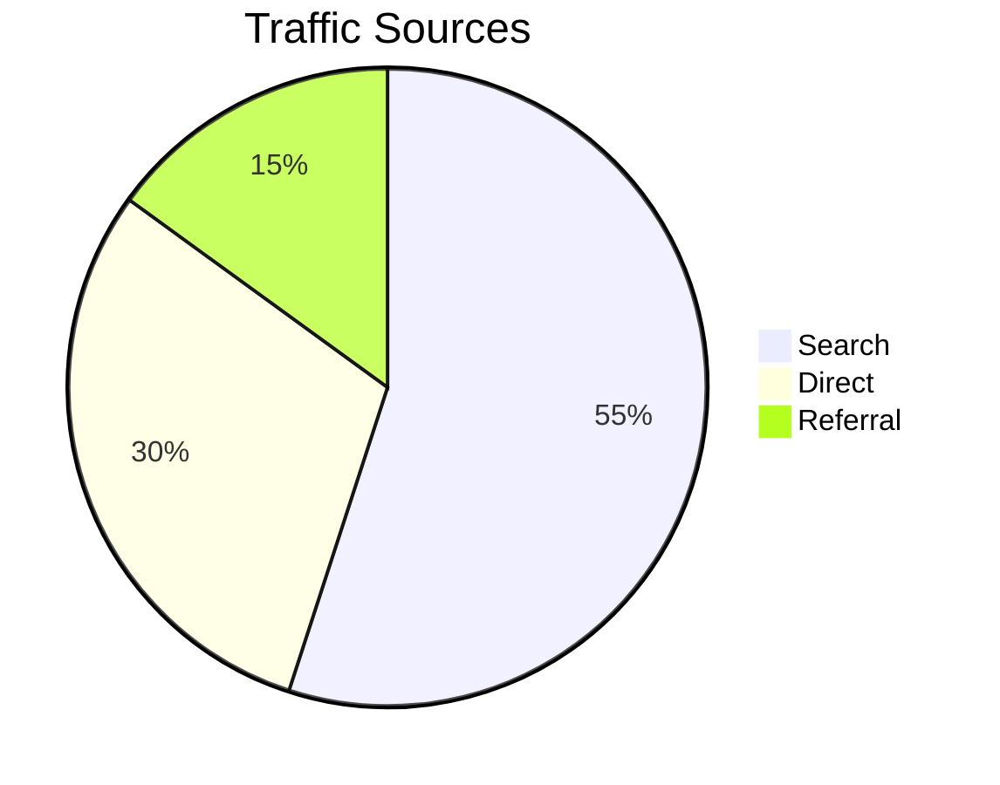
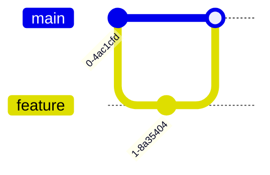
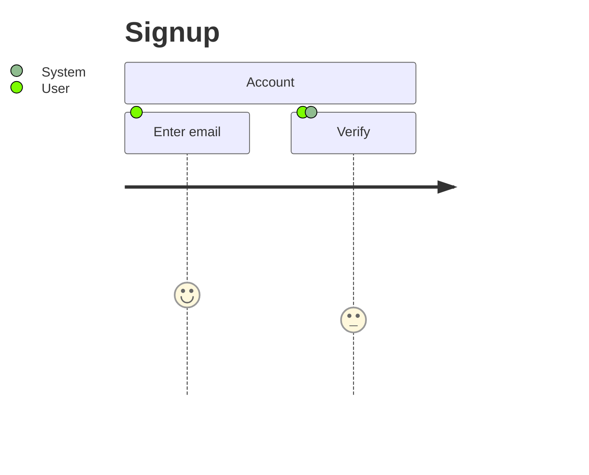
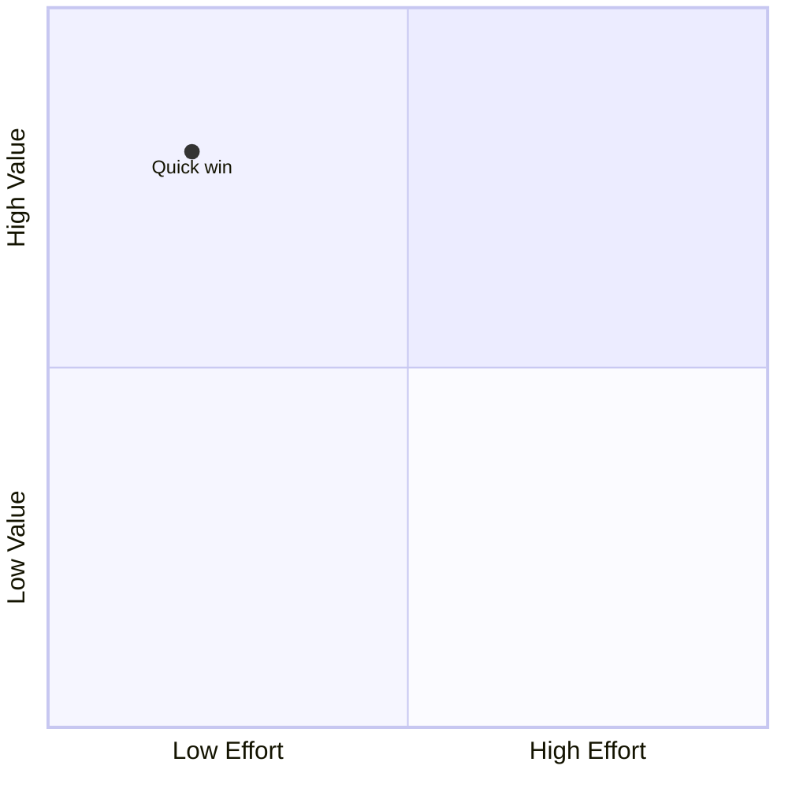
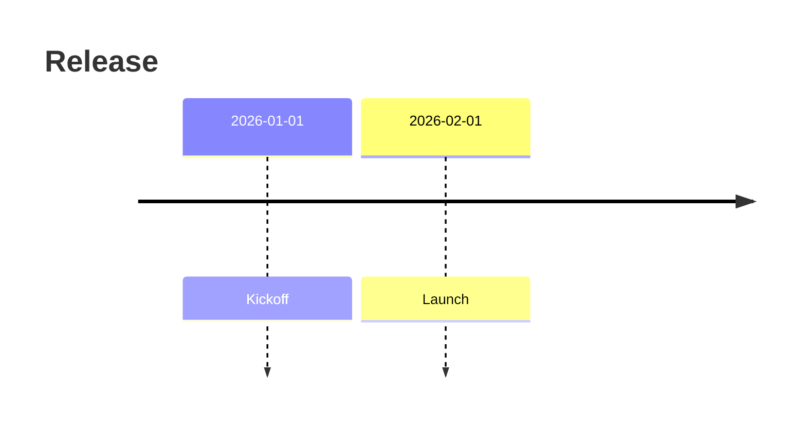
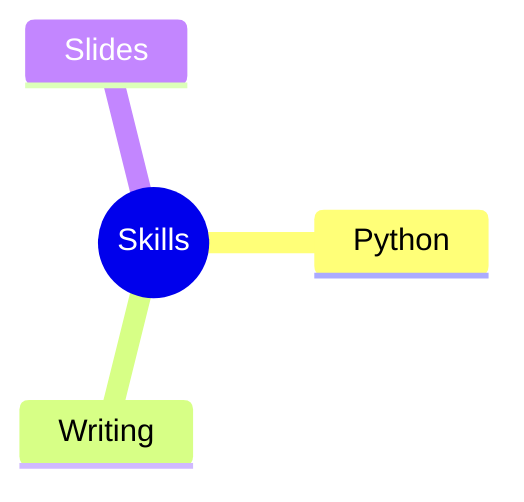
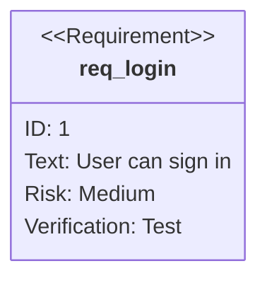
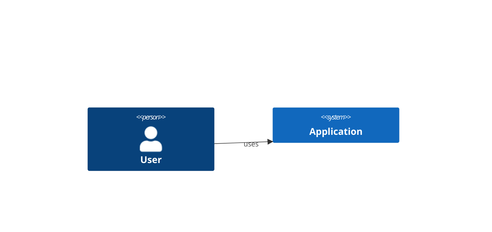

# Other Mermaid Diagram Types

Use these when the structure is not a flow, sequence, class, state, or ER diagram.

## Gantt

Use for schedules and dependencies. Example file: `assets/examples/other/gantt-basic.mmd`.

## Pie

Use for small part-to-whole breakdowns.

## Git Graph

Use for branch and release explanations.

## Journey

Use for user experience steps and sentiment.

## Quadrant

Use for two-axis prioritization.

## Timeline

Use for chronological events.

## Mindmap

Use for topic breakdowns.

## Requirement

Use for requirement traceability.

## C4 Context

Use only when Mermaid C4 is available in the target renderer.

