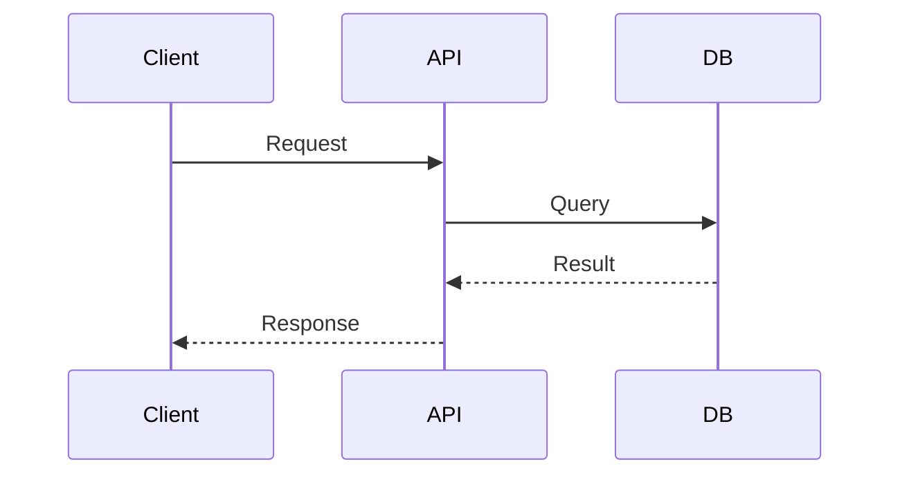
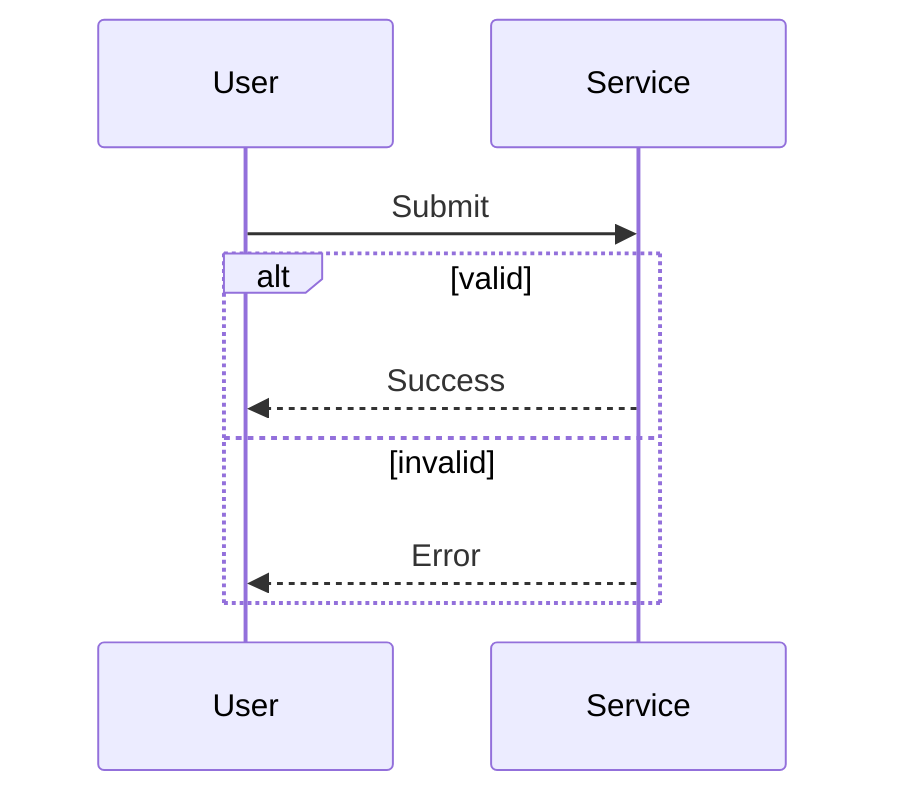

# Sequence Diagrams

Use sequence diagrams for ordered interactions between people, services, APIs, or databases.

## Minimal Pattern

Example file: `assets/examples/sequence/basic.mmd`.

## Rules

- Name participants after roles or systems, not implementation classes.
- Use `->>` for calls and `-->>` for responses.
- Add `alt`, `opt`, or `loop` only when the branch is essential.
- Prefer one scenario per diagram.

## Useful Blocks

