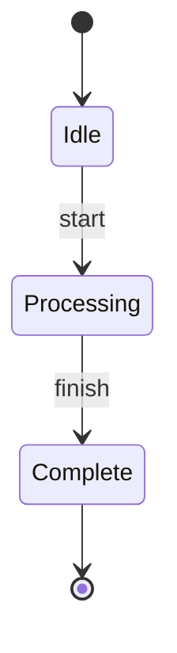
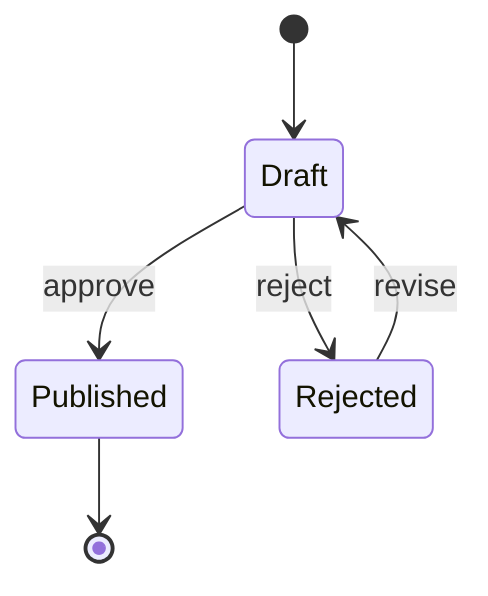

# State Diagrams

Use state diagrams for lifecycle states and allowed transitions.

## Minimal Pattern

Example file: `assets/examples/state/basic.mmd`.

## Rules

- Use states for durable conditions, not one-off actions.
- Label transitions when the trigger matters.
- Keep terminal states explicit with `[*]`.
- Split diagrams when concurrent or nested states make the chart dense.

## Branch Pattern

