# Class Diagrams

Class diagrams represent object-oriented structures, showing classes, attributes, methods, and relationships.

## Basic Syntax

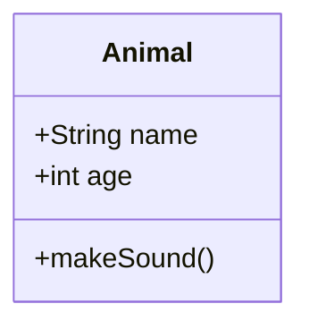

## Visibility

- `+` Public
- `-` Private
- `#` Protected
- `~` Package/Internal

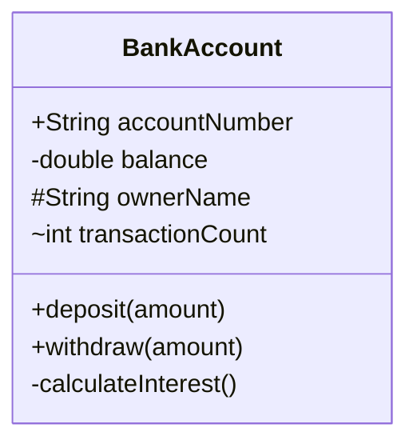

## Relationships

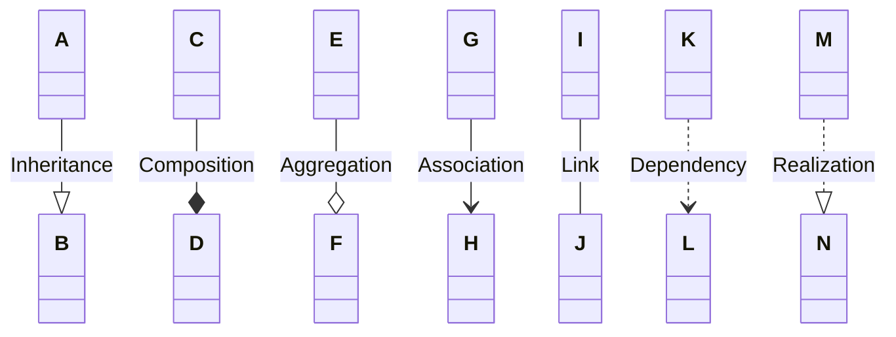

### Relationship Notation

- `--|>` Inheritance (extends)
- `--*` Composition (strong ownership)
- `--o` Aggregation (weak ownership)
- `-->` Association (uses)
- `--` Link (general connection)
- `..>` Dependency (temporary usage)
- `..|>` Realization (implements)

## Cardinality

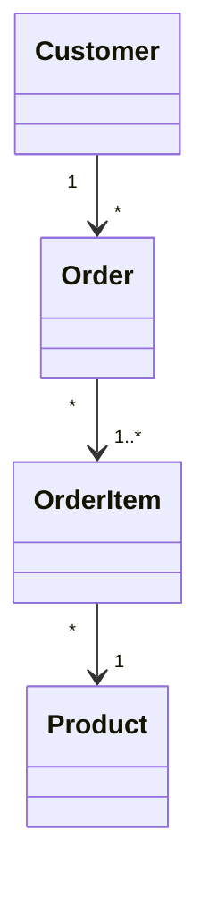

Common multiplicities:
- `1` - Exactly one
- `0..1` - Zero or one
- `*` or `0..*` - Zero or more
- `1..*` - One or more
- `n..m` - Range

## Common Patterns

### Inheritance Hierarchy

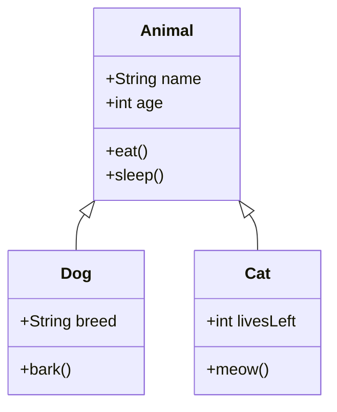

### Interface Implementation

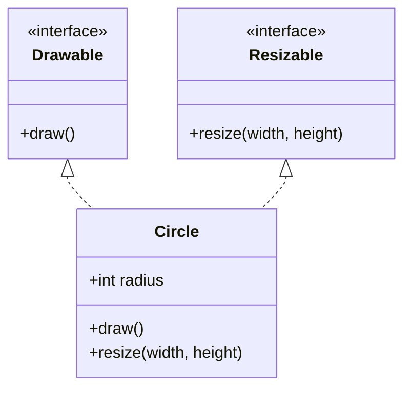

### Composition vs Aggregation

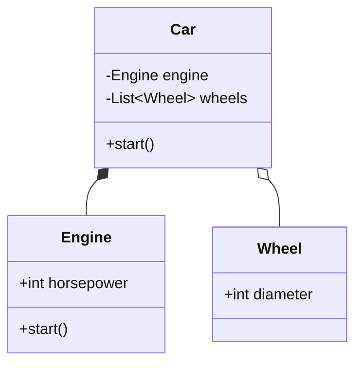

### Full System Example

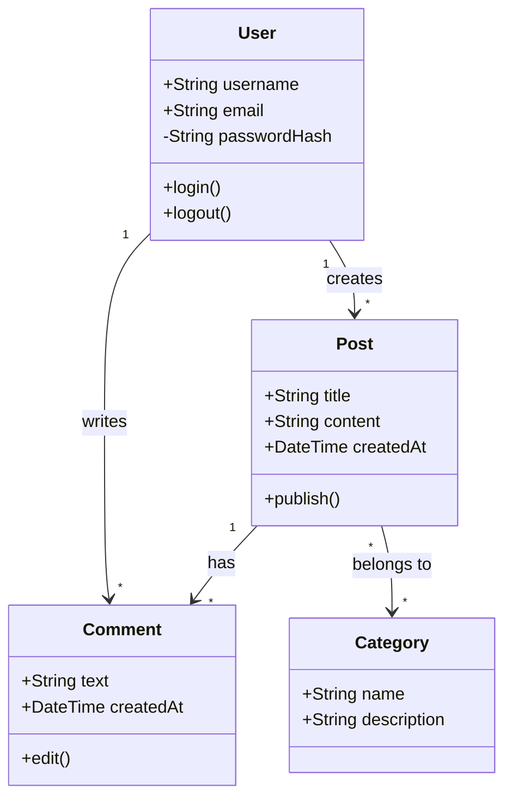

## Best Practices

- Use meaningful class and attribute names
- Show only relevant attributes and methods (not every getter/setter)
- Use proper visibility modifiers
- Choose appropriate relationships (composition vs aggregation)
- Keep diagrams focused - split large systems into multiple diagrams
- Use interfaces and abstract classes where appropriate
- Include cardinality on associations
- Group related classes visually

## Advanced Features

### Annotations

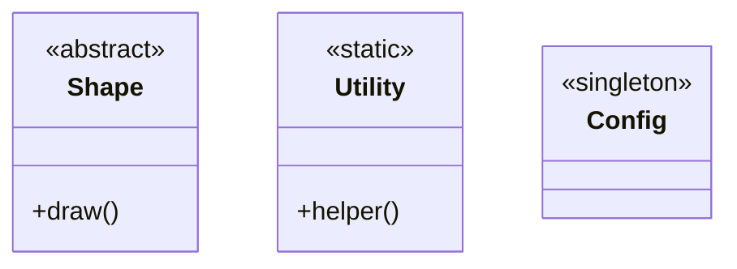

Common annotations:
- `<<interface>>`
- `<<abstract>>`
- `<<service>>`
- `<<enumeration>>`
- `<<singleton>>`

### Generics

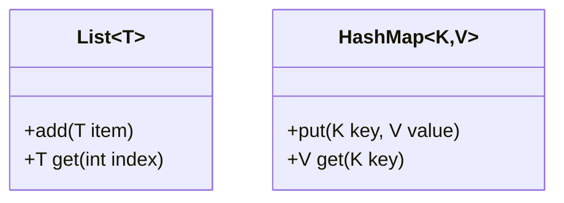

### Namespaces

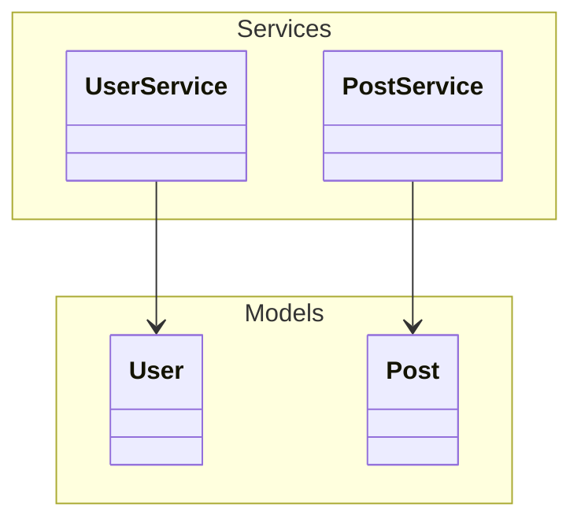

### Notes

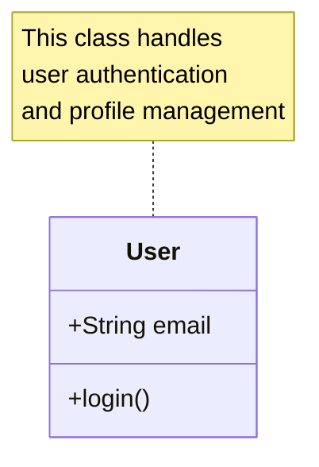

### Return Types and Parameters

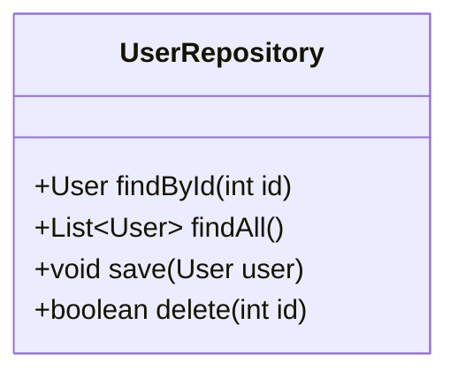
