# Entity-Relationship Diagrams

ER diagrams model database schemas, showing entities, attributes, and relationships.

## Basic Syntax

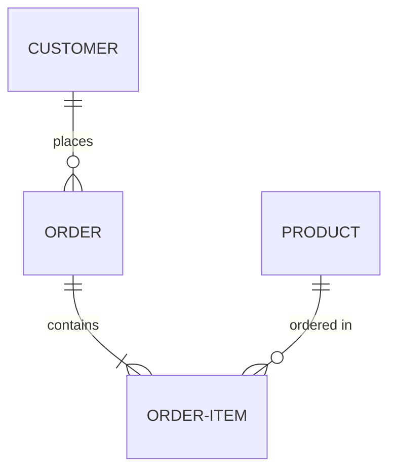

## Entities and Attributes

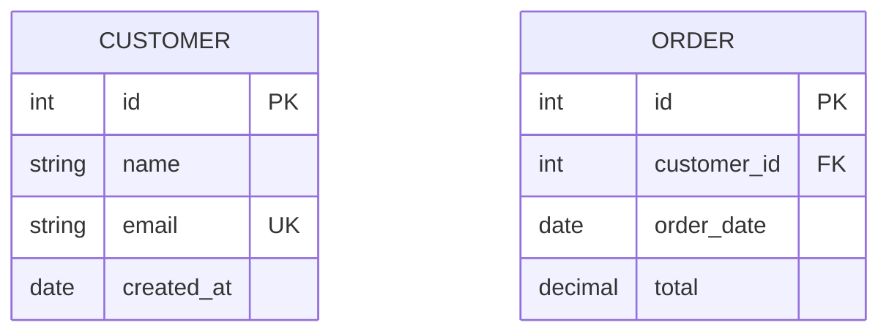

Attribute annotations:
- `PK` - Primary Key
- `FK` - Foreign Key
- `UK` - Unique Key

## Relationship Cardinality

Cardinality notation:
- `||` - Exactly one
- `o|` - Zero or one
- `}o` - Zero or more
- `}|` - One or more

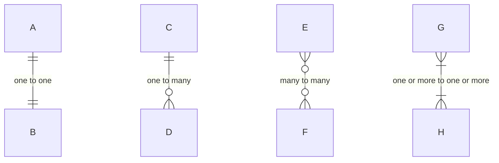

## Common Patterns

### Blog System

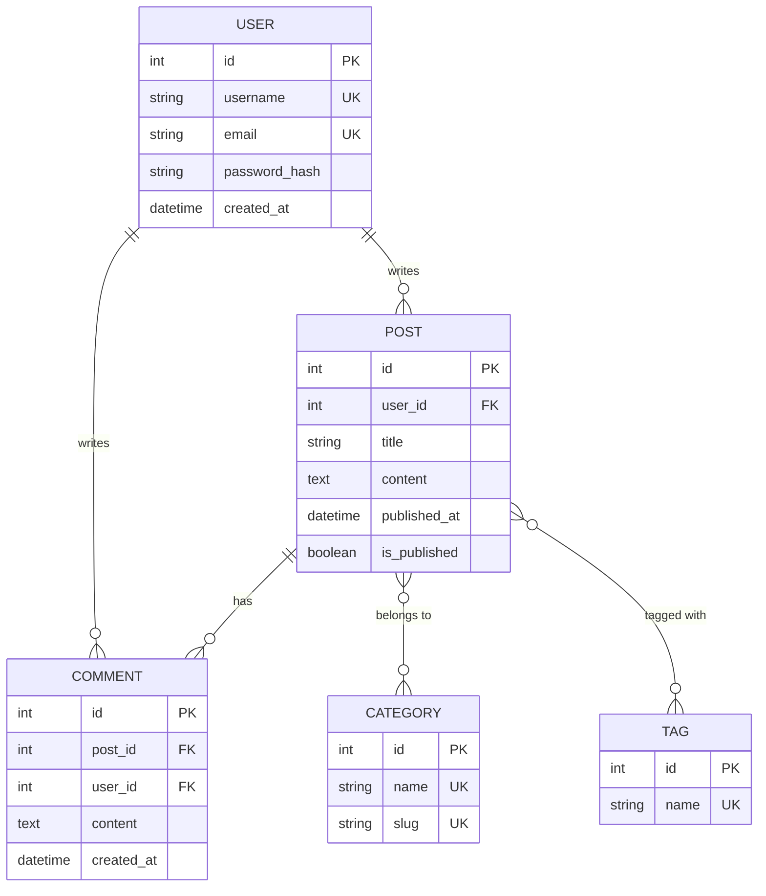

### E-commerce

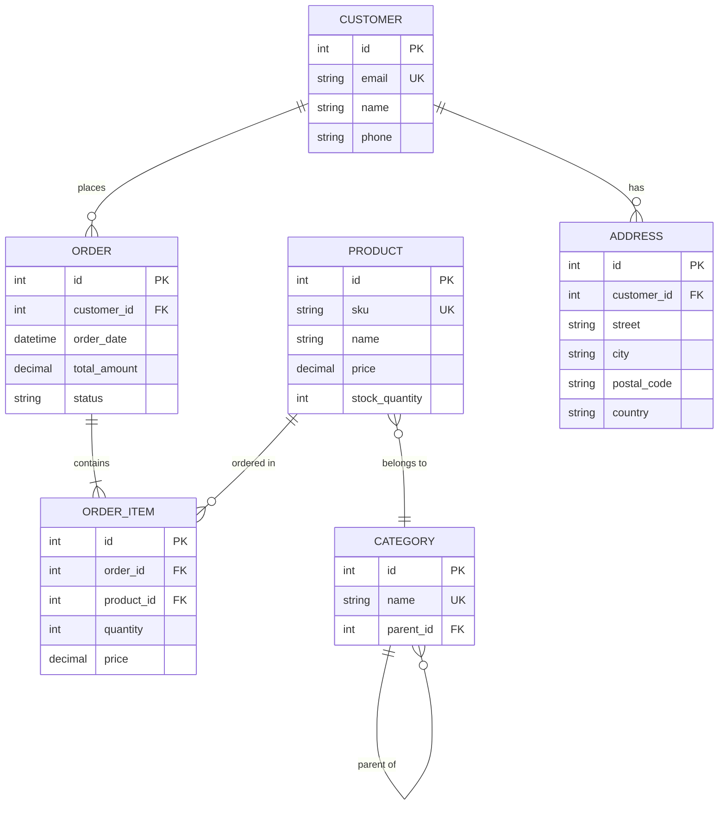

### User Management

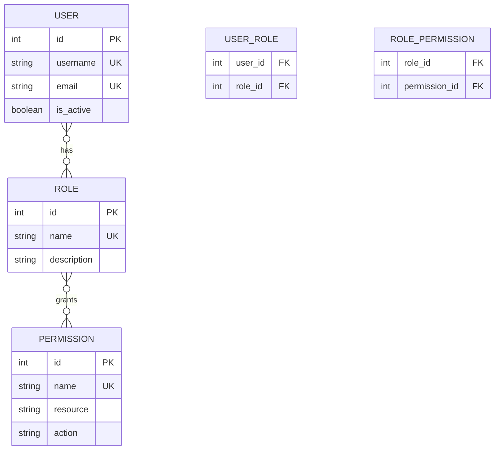

### Course Management

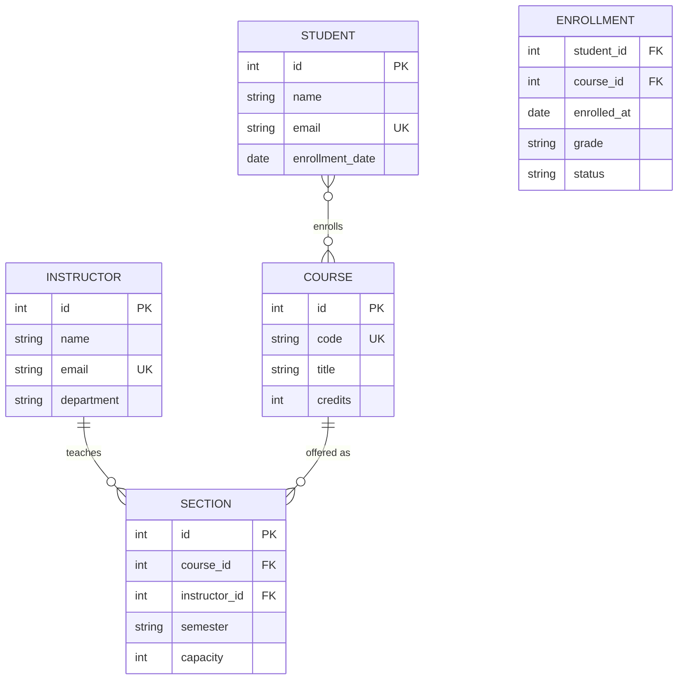

## Best Practices

- Use singular nouns for entity names (USER, not USERS)
- Use UPPERCASE for entity names
- Include primary keys (PK) for all entities
- Mark foreign keys (FK) explicitly
- Use meaningful relationship labels
- Show cardinality correctly
- Include important constraints (UK for unique keys)
- Keep attribute types clear (int, string, date, etc.)
- Don't over-complicate - focus on key relationships

## Advanced Features

### Self-Referencing Relationships

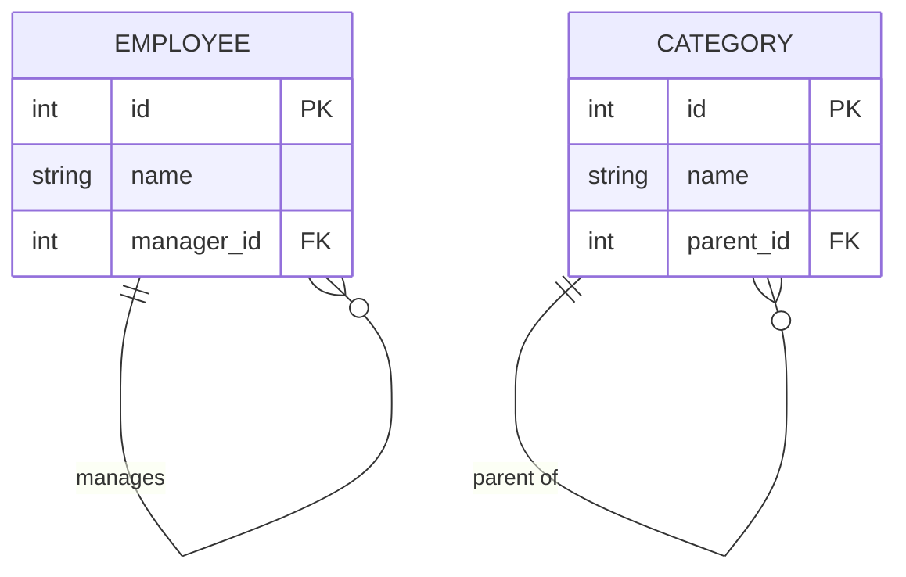

### Weak Entities

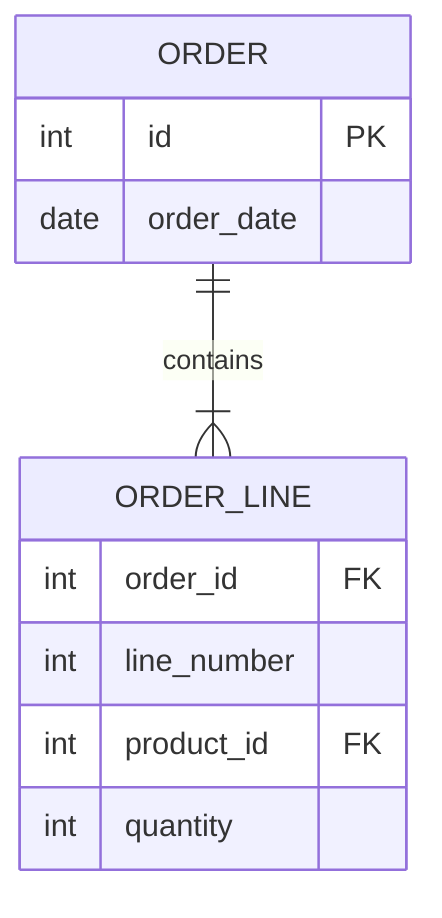

### Ternary Relationships

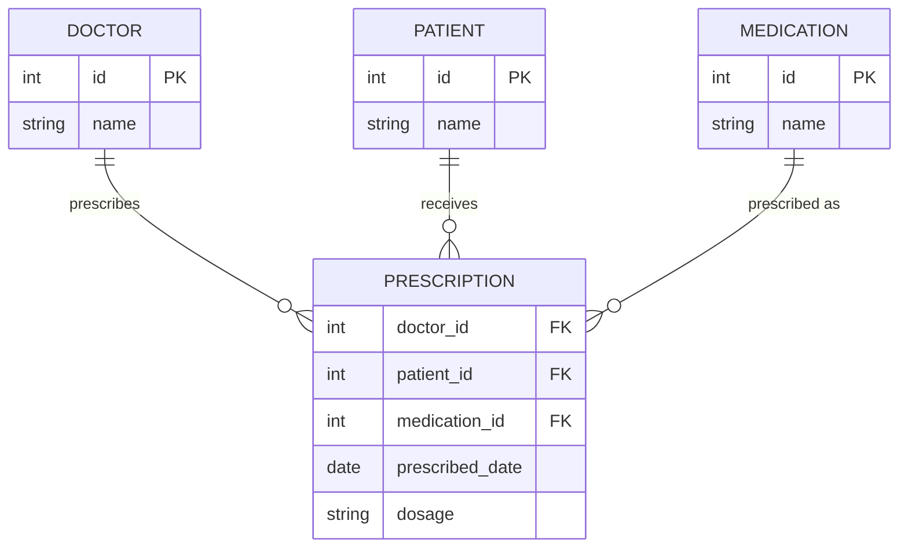

## Relationship Labels

Use clear, meaningful labels:

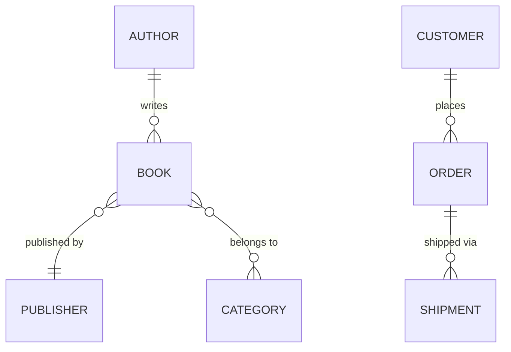
