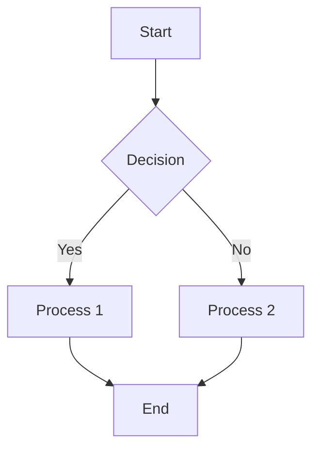
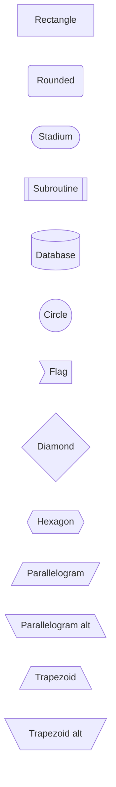
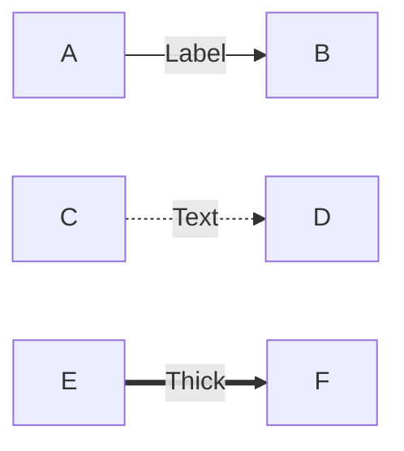
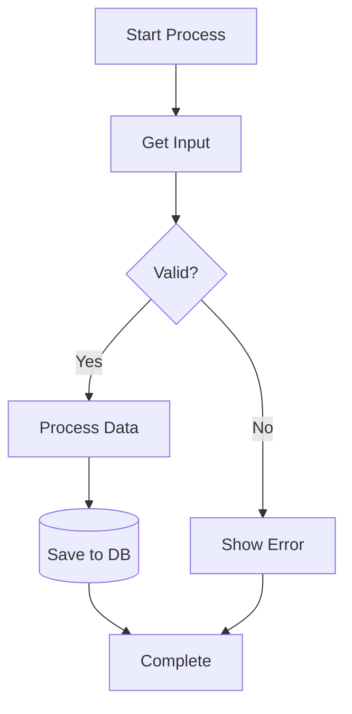
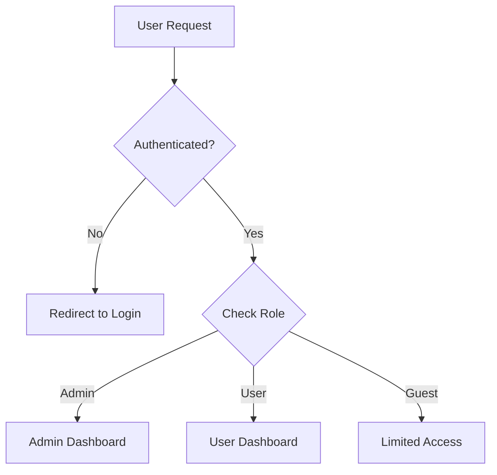
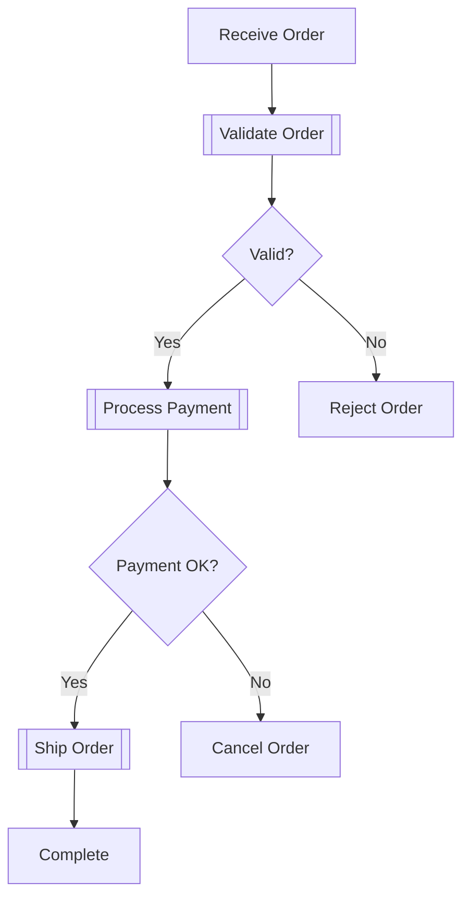
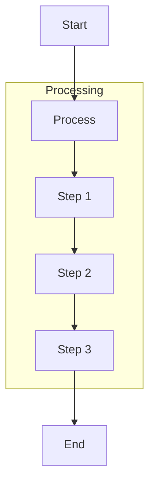
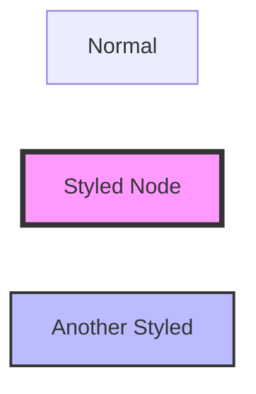
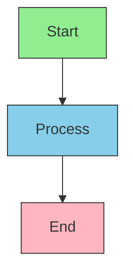

# Flowchart Diagrams

Flowcharts represent processes, workflows, and decision trees.

## Basic Syntax



## Direction

- `TD` or `TB` - Top to bottom
- `BT` - Bottom to top
- `LR` - Left to right
- `RL` - Right to left

## Node Shapes



## Connections

```mermaid
flowchart LR
    A --> B        %% Arrow
    C --- D        %% Line
    E -.-> F       %% Dotted arrow
    G -.- H        %% Dotted line
    I ==> J        %% Thick arrow
    K == L         %% Thick line
```

## Labeled Links



## Common Patterns

### Simple Process Flow



### Decision Tree



### Workflow with Subprocesses



## Best Practices

- Use descriptive labels for nodes and connections
- Keep flows top-to-bottom or left-to-right for readability
- Group related processes visually
- Use consistent node shapes (rectangles for processes, diamonds for decisions)
- Limit complexity - split large flows into multiple diagrams
- Use subgraphs for logical grouping (see advanced features)

## Advanced Features

### Subgraphs



### Styling



### Class Definitions


