# Other Diagram Types

This reference covers additional Mermaid diagram types: Gantt, Pie, Git, Journey, Quadrant, Timeline, and more.

## Gantt Charts

Project timelines and task scheduling.

### Basic Gantt

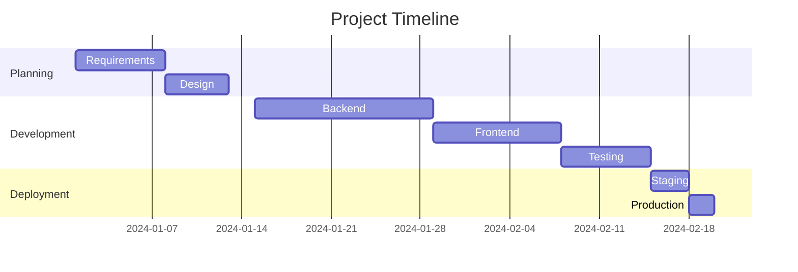

### Task Status

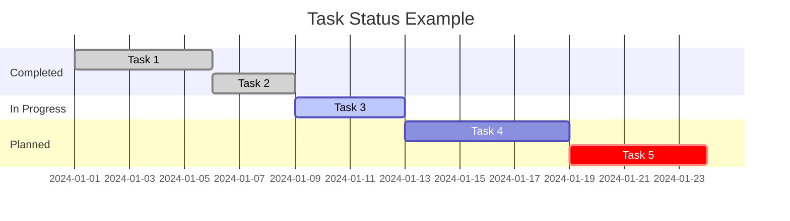

Status keywords:
- `done` - Completed task
- `active` - In progress
- `crit` - Critical task
- No keyword - Planned task

## Pie Charts

Data distribution visualization.

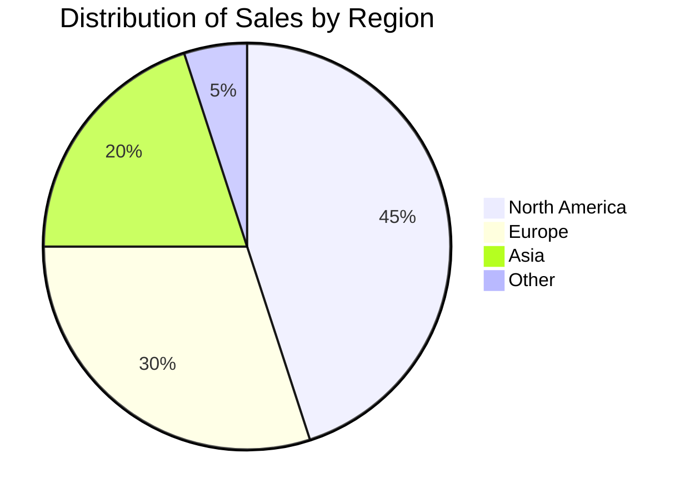

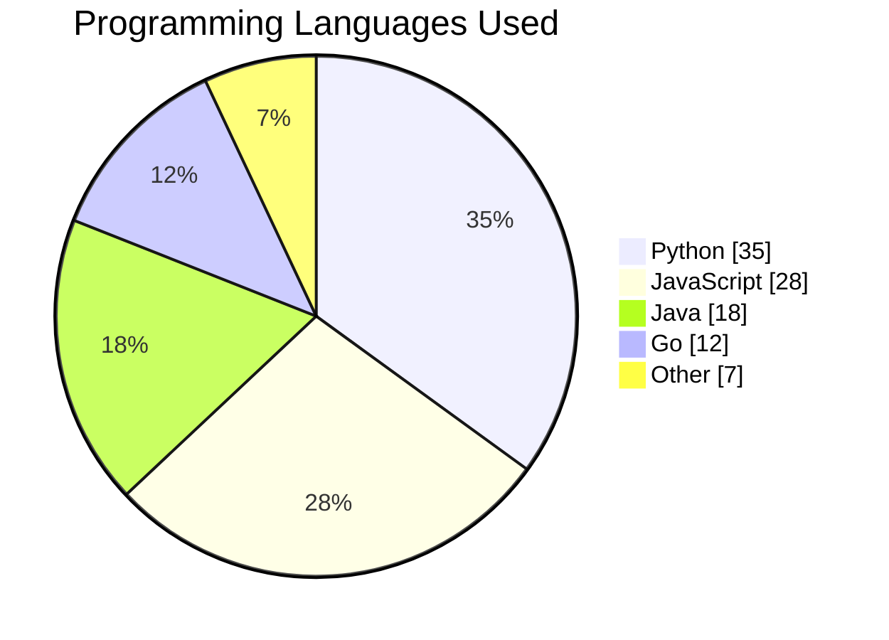

Use `showData` to display percentages.

## Git Graphs

Git commit history and branching.

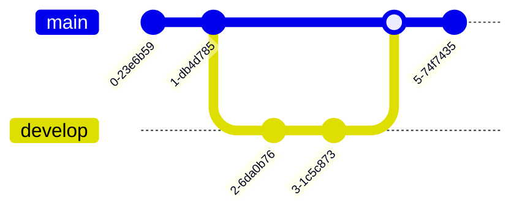

### Feature Branch Workflow

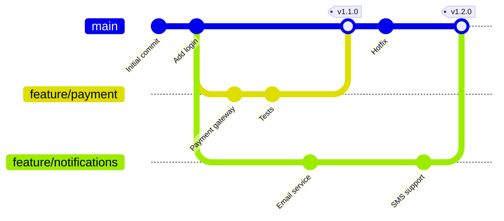

### With Tags and IDs

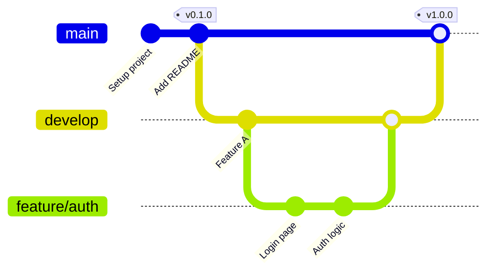

## User Journey

User experience and interaction flows.

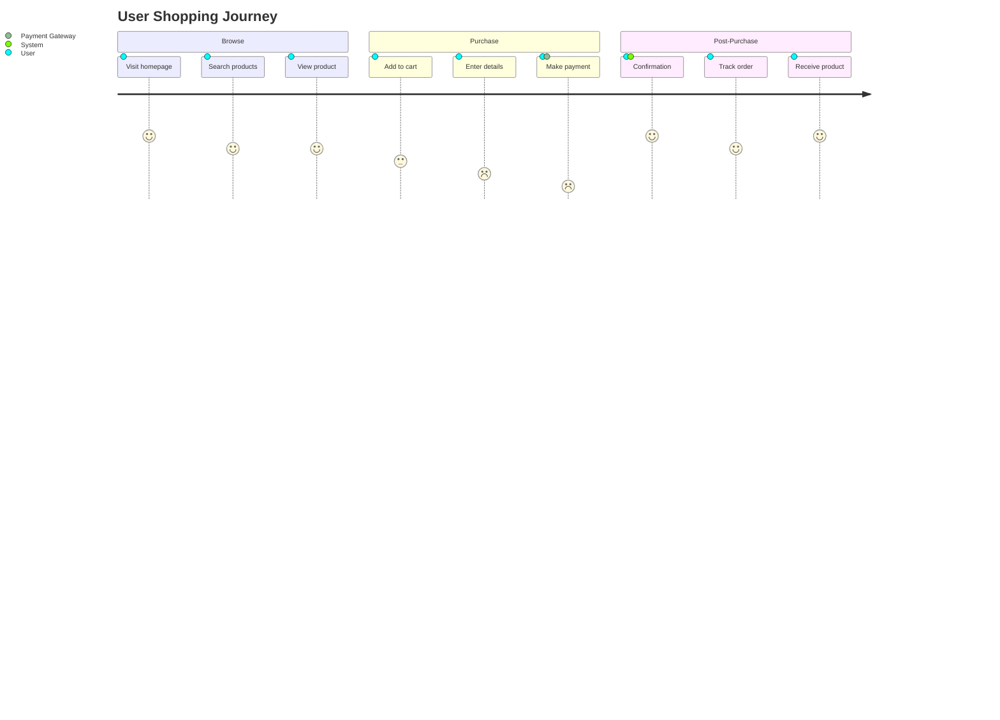

Score meanings:
- 5 - Very satisfied
- 4 - Satisfied
- 3 - Neutral
- 2 - Dissatisfied
- 1 - Very dissatisfied

### Service Experience

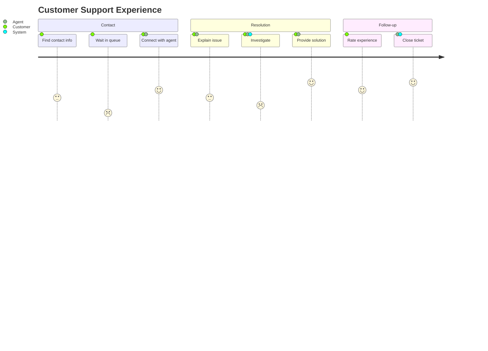

## Quadrant Chart

2D comparison and categorization.

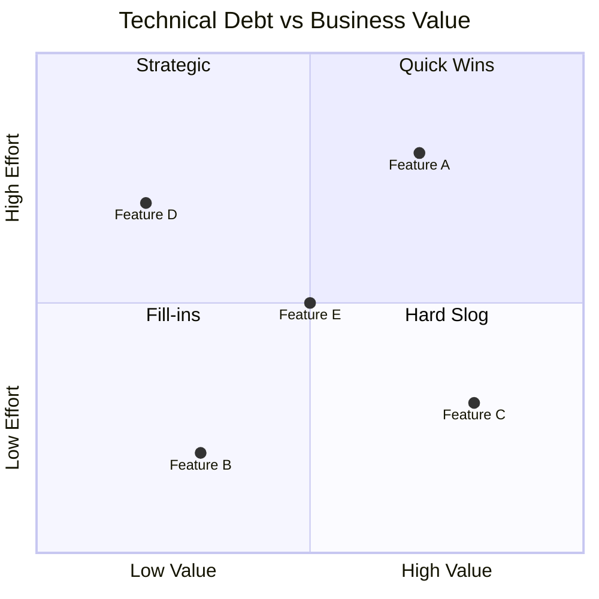

### Priority Matrix

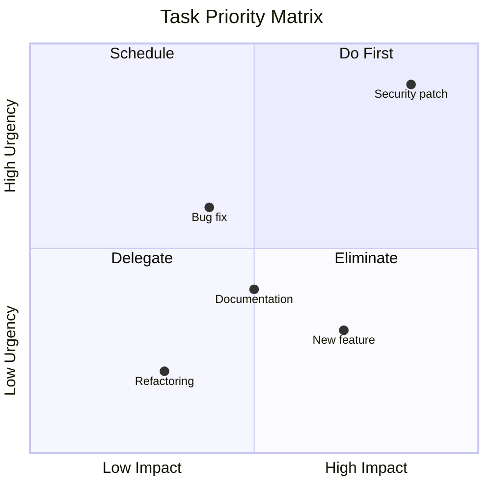

## Timeline

Chronological events.

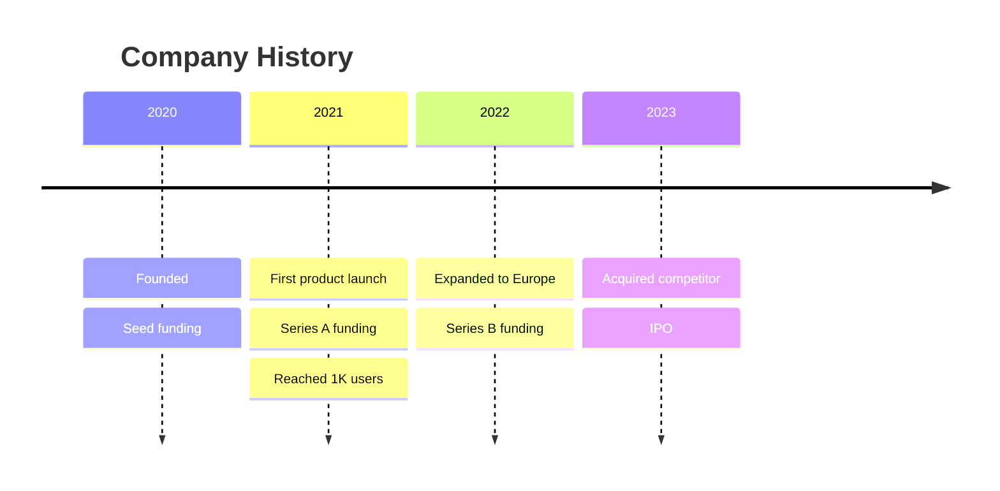

### Project Milestones

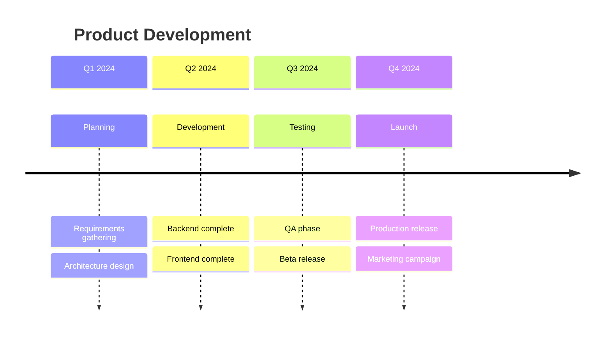

## Mindmap

Hierarchical idea organization.

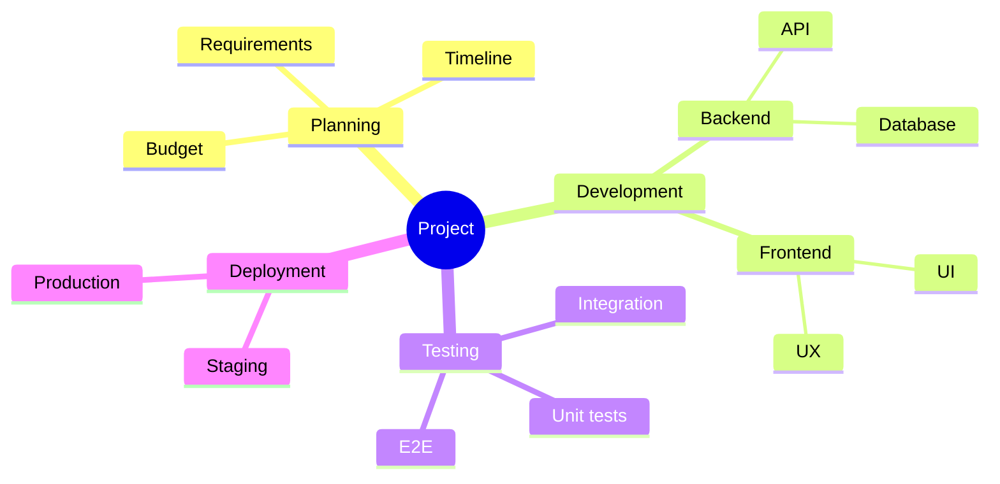

## Requirement Diagram

Requirements and their relationships.

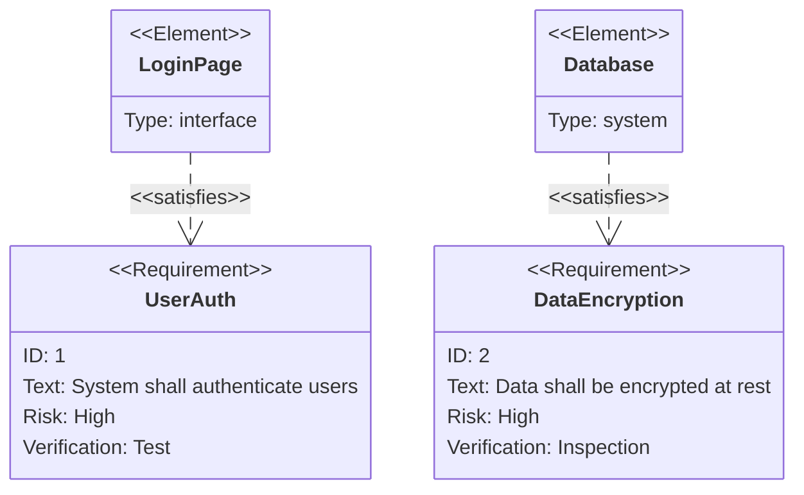

## C4 Diagram

Software architecture context.

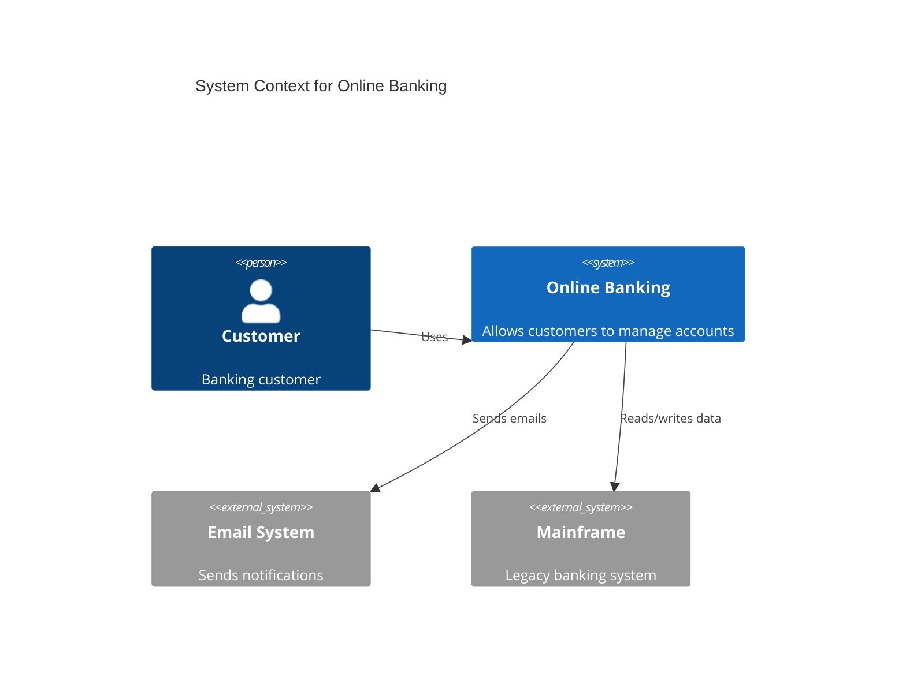

## Best Practices by Type

### Gantt
- Use realistic date formats
- Mark critical path tasks with `crit`
- Group related tasks in sections
- Use `after` for dependencies

### Pie
- Keep to 5-7 slices maximum
- Combine small slices into "Other"
- Use `showData` for transparency

### Git
- Use meaningful commit IDs
- Tag important releases
- Show realistic branch patterns

### Journey
- Keep to 3-5 sections
- Use consistent actor names
- Score from user perspective

### Quadrant
- Choose meaningful axis labels
- Use all four quadrants
- Place items thoughtfully

### Timeline
- Group by logical periods
- Use sections for organization
- Keep descriptions concise
