# Sequence Diagrams

Sequence diagrams show interactions between actors and systems over time.

## Basic Syntax

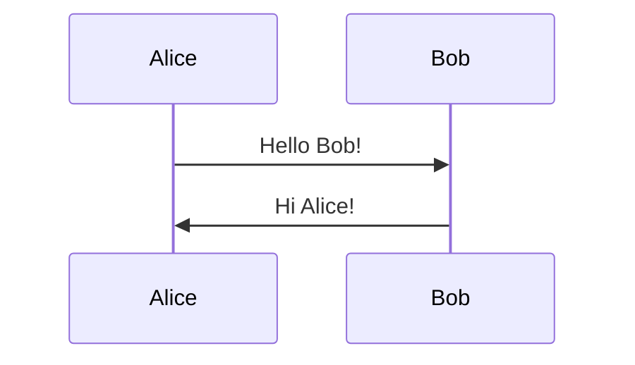

## Participants

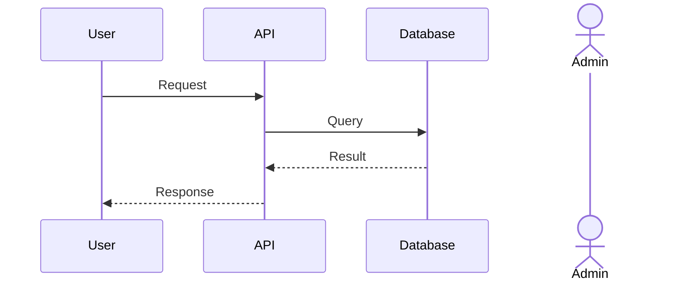

Use `participant` for systems, `actor` for human actors.

## Message Types

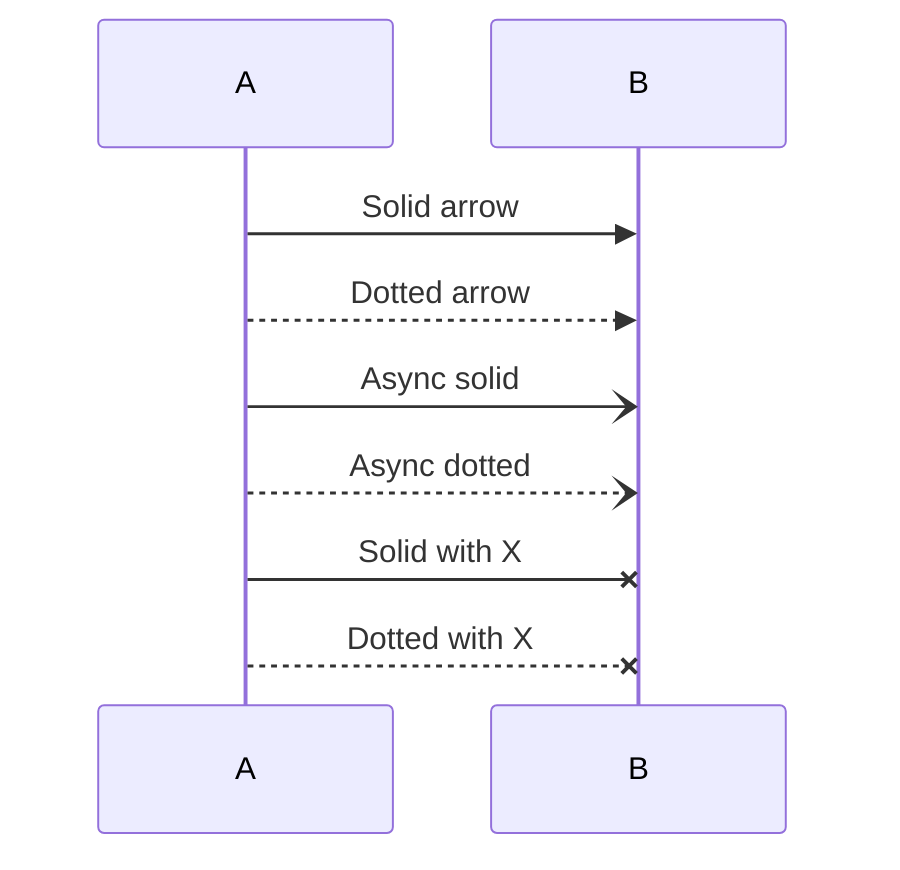

## Activations

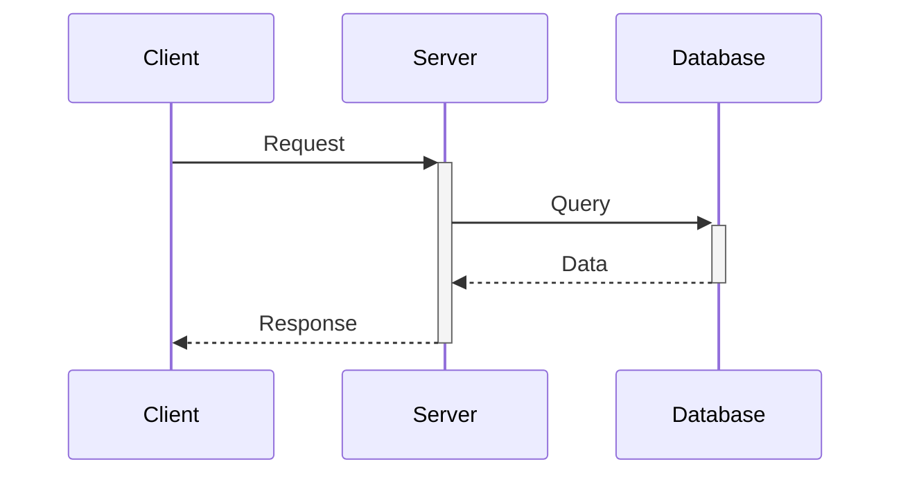

`+` activates, `-` deactivates.

## Notes

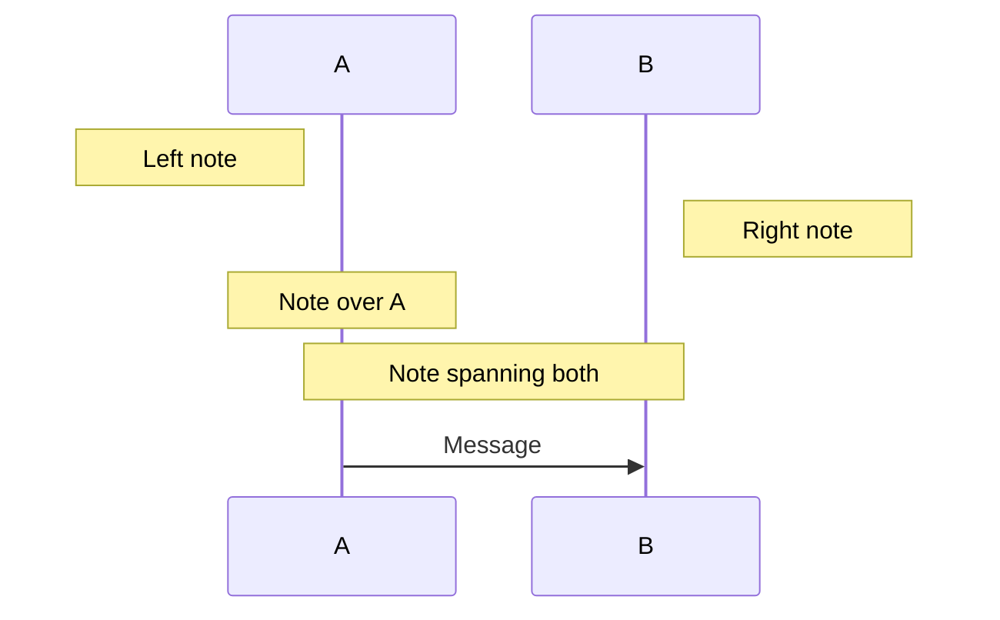

## Loops and Conditionals

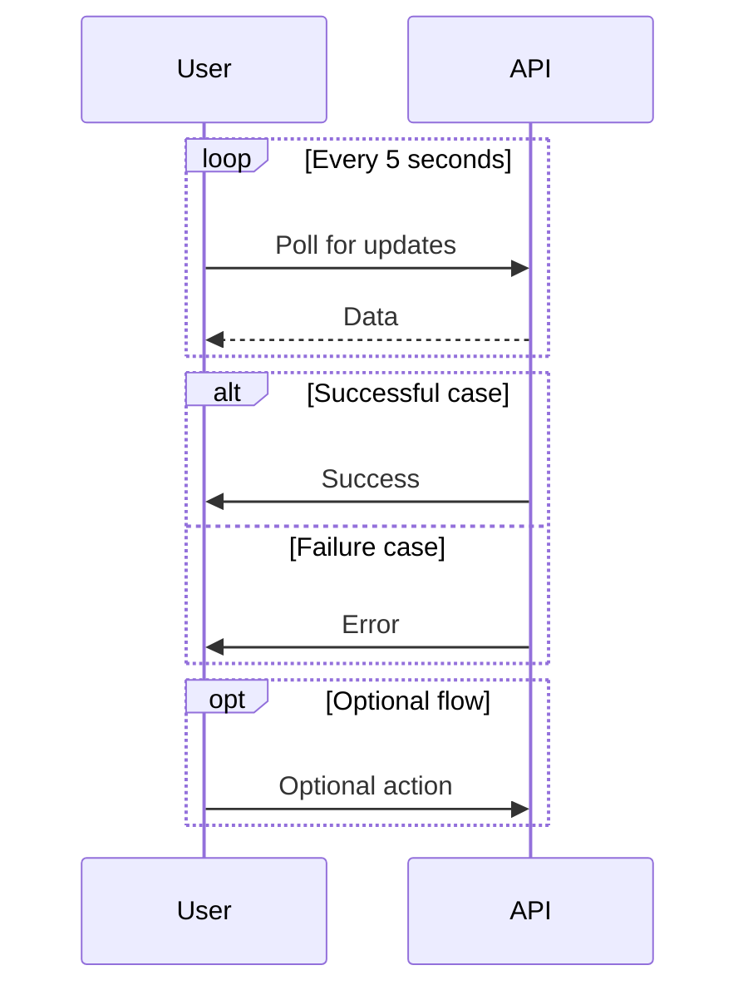

## Common Patterns

### REST API Call

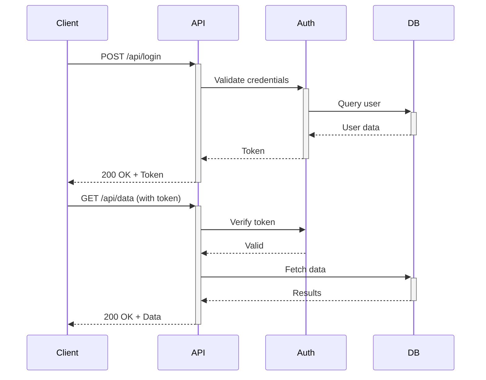

### Authentication Flow

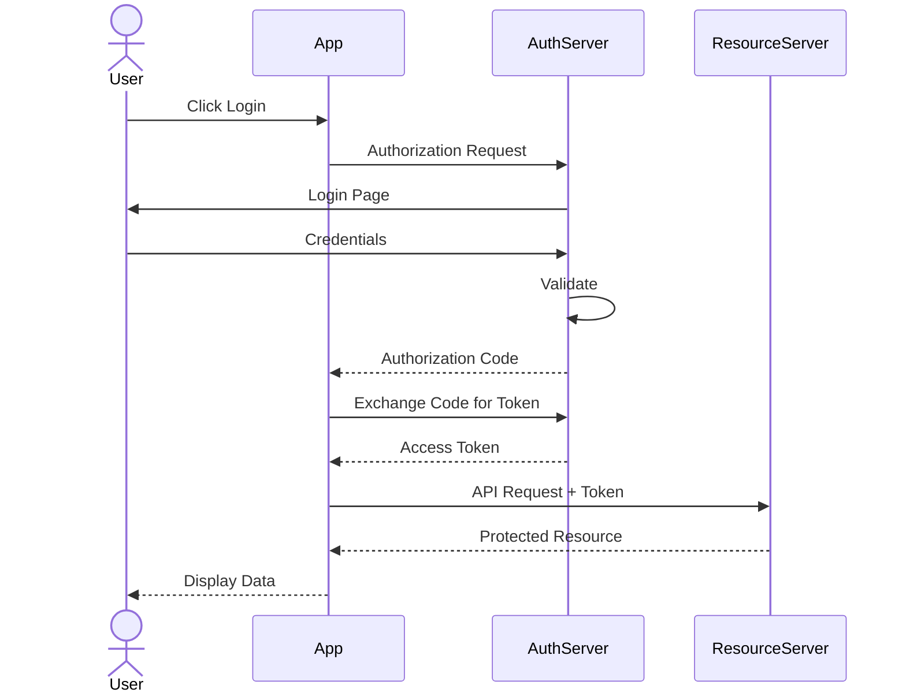

### Error Handling

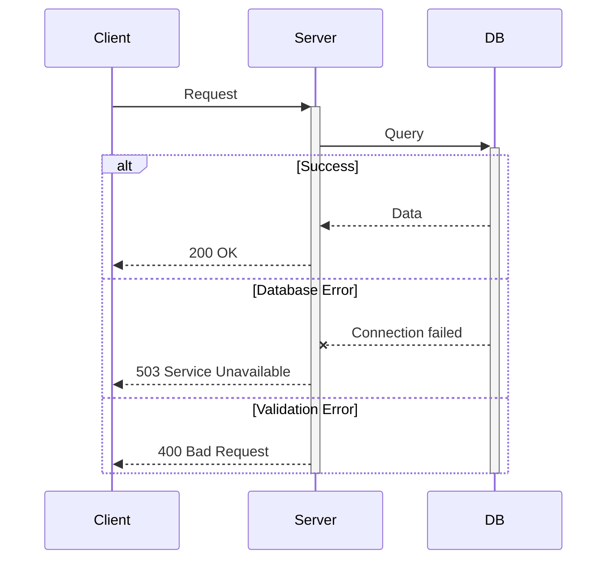

## Best Practices

- Use clear participant names (User, API, Database, not A, B, C)
- Show activation bars for long-running operations
- Use notes to explain complex logic
- Keep sequences focused - split complex flows into multiple diagrams
- Use `actor` for human users, `participant` for systems
- Label messages with meaningful descriptions
- Use alt/else/opt for branching logic
- Show both request and response messages

## Advanced Features

### Autonumber

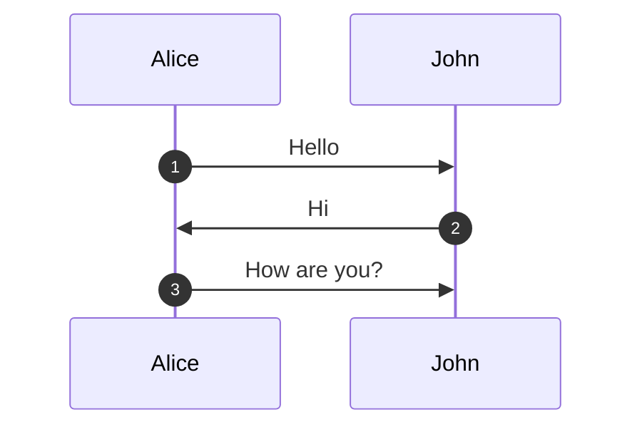

### Background Colors

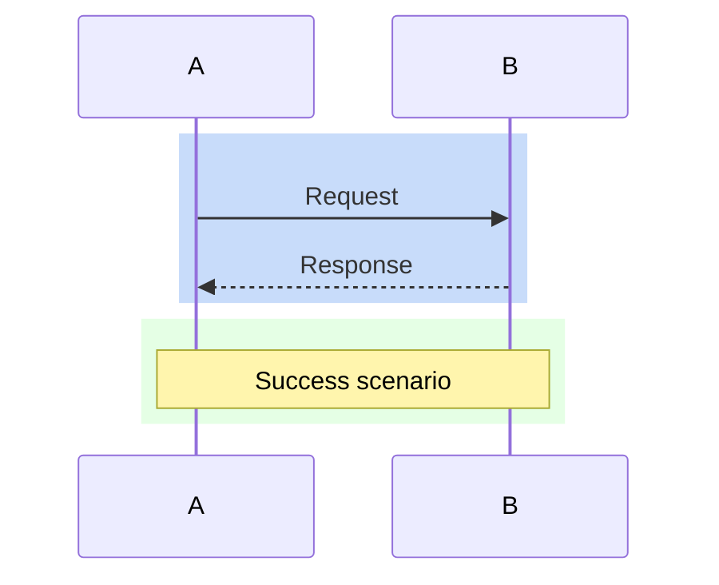

### Critical Region

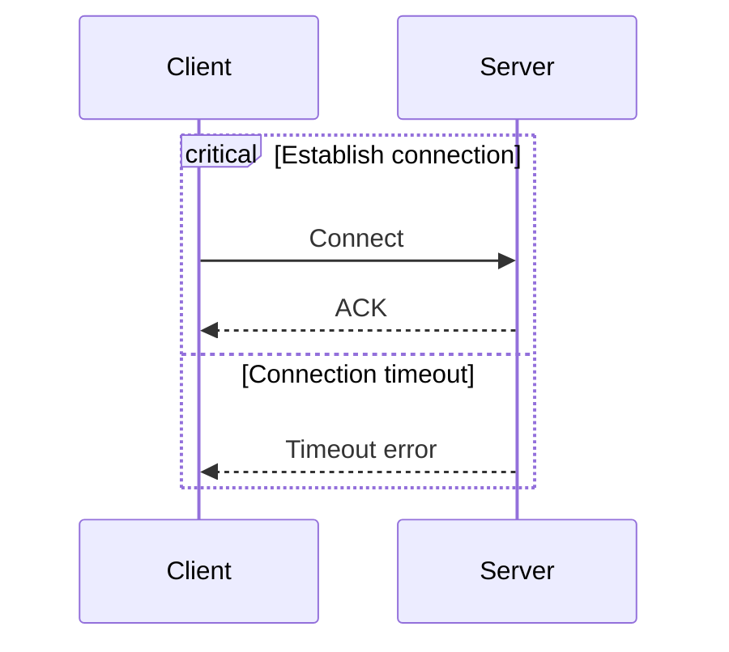
