# State Diagrams

State diagrams model the states of a system and transitions between them.

## Basic Syntax

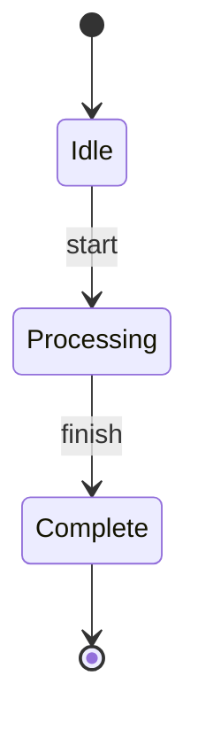

## States

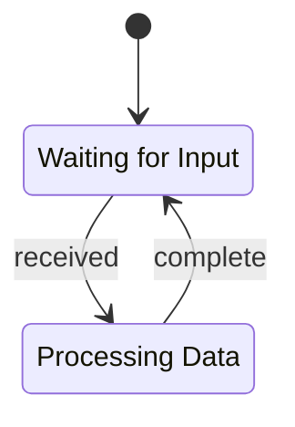

## Composite States

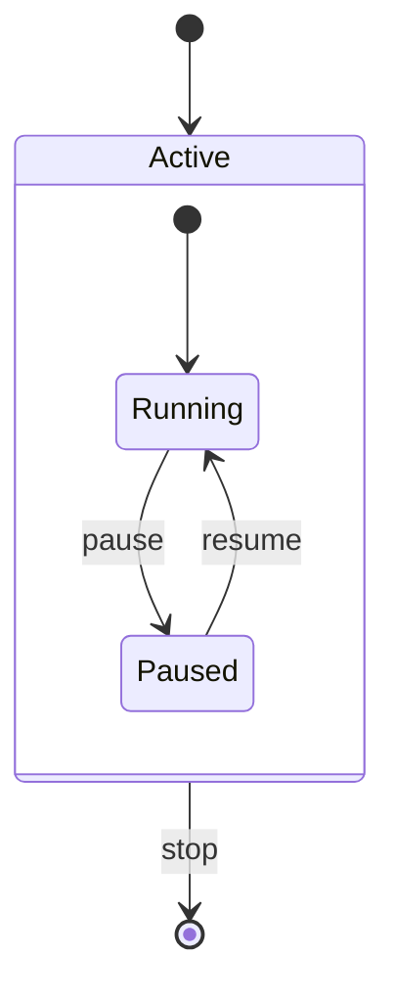

## Choice (Conditional)

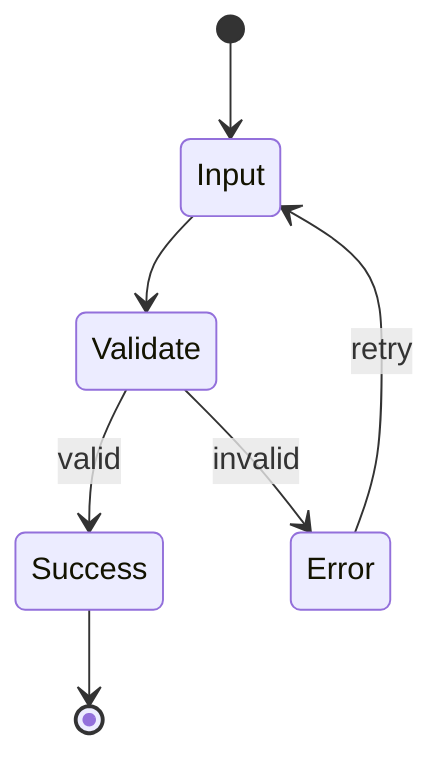

## Fork and Join

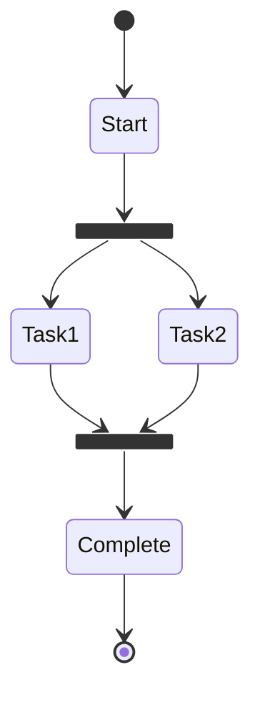

## Common Patterns

### Simple State Machine

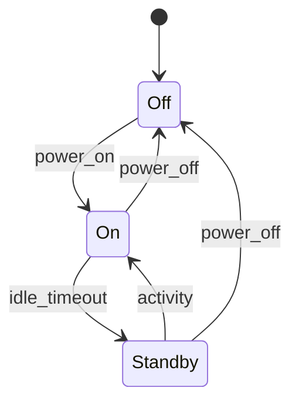

### Order Processing

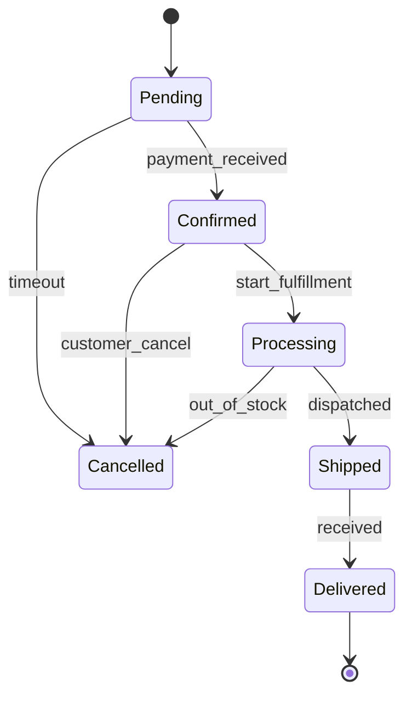

### User Authentication

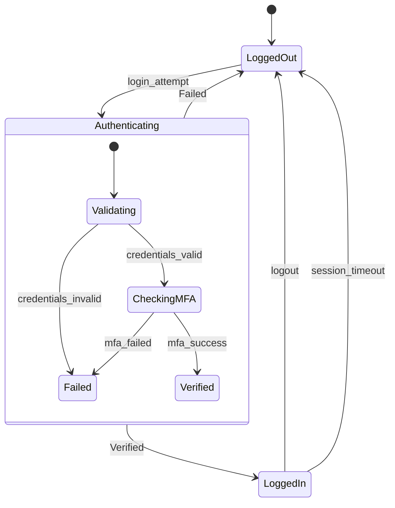

### Document Workflow

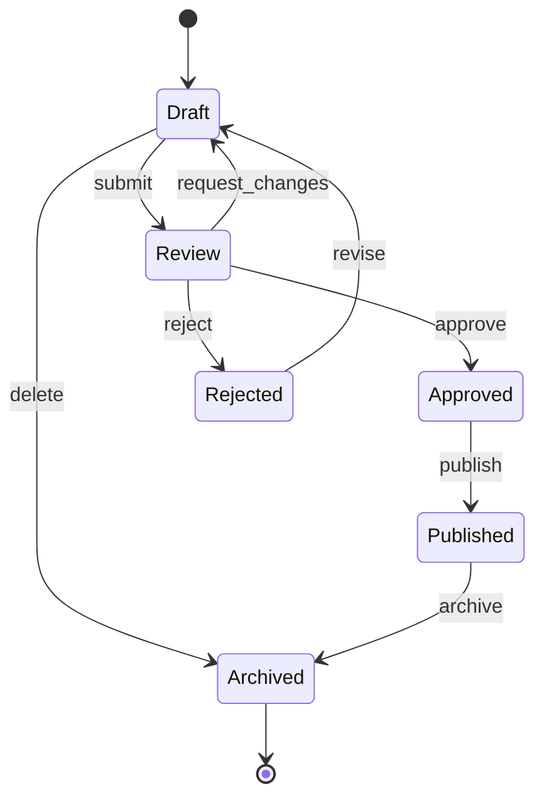

## Best Practices

- Start with `[*]` for initial state
- End with `[*]` for final state
- Use descriptive state names
- Label all transitions clearly
- Use composite states for complex subsystems
- Use choice states for conditional branching
- Keep diagrams focused on one workflow
- Use fork/join for parallel operations

## Advanced Features

### State Descriptions

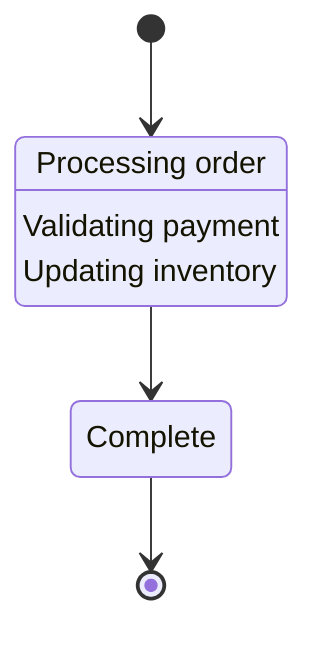

### Notes

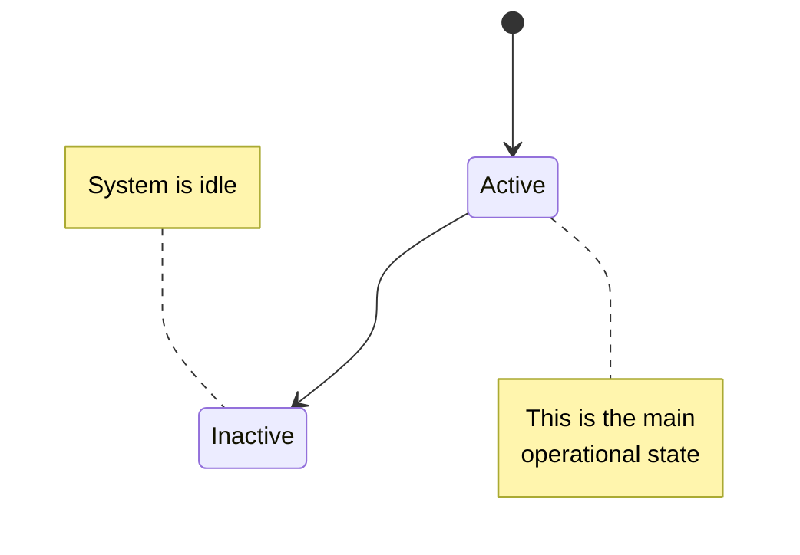

### Concurrency (Parallel States)

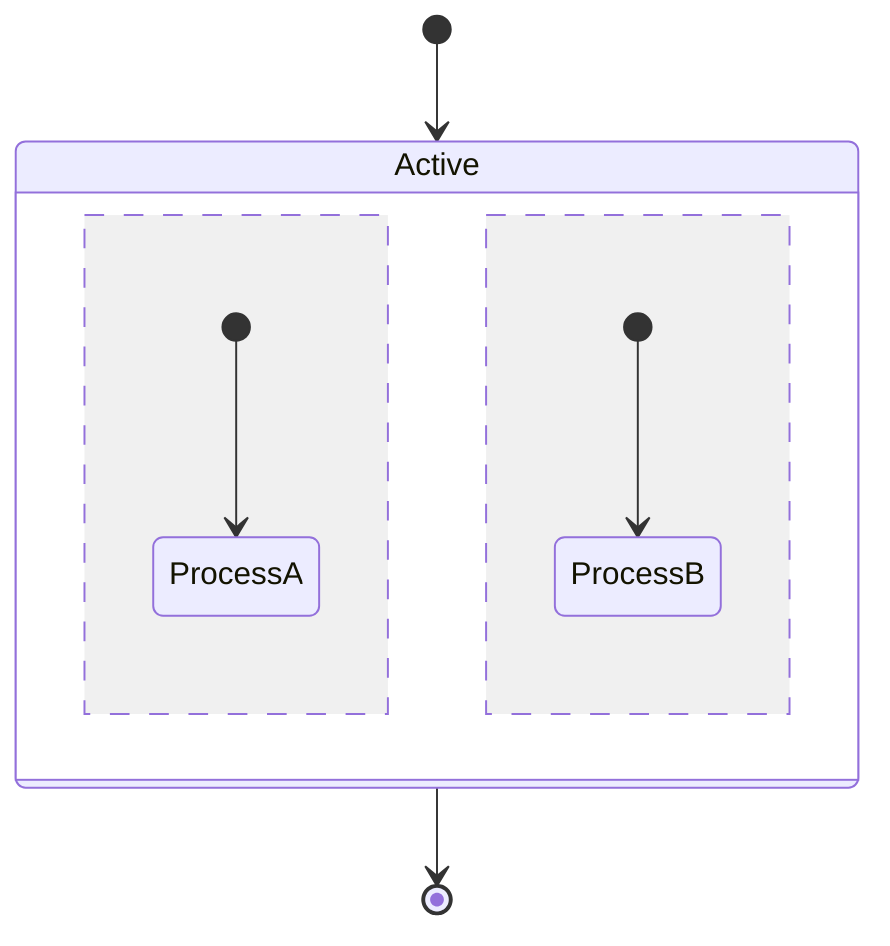

The `--` separator creates parallel regions within a composite state.

### Direction

Use `direction LR` for left-to-right layout:

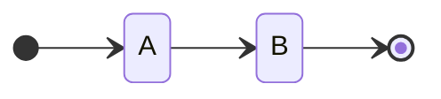

## Complex Example

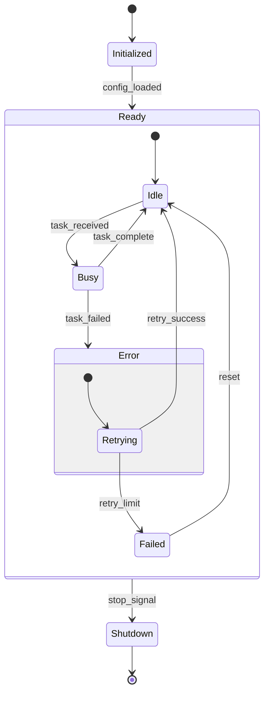
